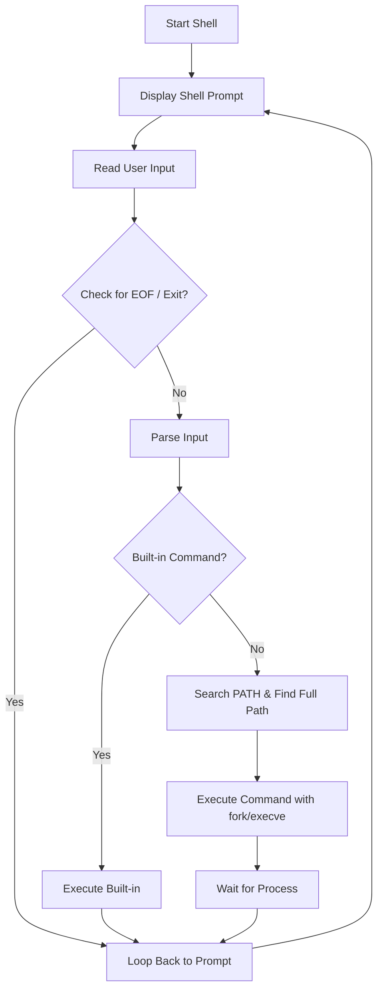

 
 
 <dive></dive>

 <div align="center">

  #  ˖°𓇼🌊⋆🐚🫧 C - Simple Shell Project ˖°𓇼🌊⋆🐚🫧
  

 
  <br/> 
  
</div>

## 🏝️ Description

This shell was created by Maram and Hessah as a project at Holberton School.  
This project implements a simple UNIX command-line interpreter (shell). It executes commands, handles built-in commands (`exit`, `env`), and works with the environment variables. It supports both interactive and non-interactive modes, and executes standard system commands.


---
## Tasks Overview ⤵️
 <details>
 
<summary> Tasks Breakdown List : </summary> 

  - **Task 0: README, man, AUTHORS**  
    Create a `README.md`, a `man` page, and an `AUTHORS` file. 

  - **Task 1: Betty Style**  
    Adhere to Betty coding style. 

  - **Task 2: Simple Shell 0.1**  
    Implement a basic shell with command execution. 

  - **Task 3: Simple Shell 0.2**  
    Handle commands with arguments. 

  - **Task 4: Simple Shell 0.3**  
    Implement PATH handling for locating commands. 

  - **Task 5: Simple Shell 0.4**  
    Implement the `exit` built-in. 

  - **Task 6: Simple Shell 1.0**  
    Implement the `env` built-in. 

</details>

 <details>
 
<summary> Click here to see the flowchart of the project: </summary> 



 <br>
 <br>
</details>
 <br/>
 <br/>

 
 - **🌟 Advanced Task 7: Blog Post on `ls -l *.c`**  
    Write a blog post about what happens when `ls -l *.c` is executed.

  <div align="center">  <p style="text-align: center;">
  <a href="https://www.linkedin.com/pulse/what-really-happens-when-you-type-ls-l-c-shell-hessah-a-yfeue">
    
  </a> </p></div
</p>


---

## 🏝️ How to Run

1. Clone the repository:  
   `git clone https://github.com/username/holbertonschool-simple_shell.git`

2. Navigate into the directory:  
   `cd holbertonschool-simple_shell`

3. Compile the code:  
   `gcc -Wall -Werror -Wextra -pedantic *.c -o shell`

4. Run the shell:  
   `./shell`


## 🏝️ Usage
```bash
$ ./hsh
$ ls
$ pwd
$ env
$ exit
```

## 🏝️ Features

- Display a prompt and wait for the user to type a command
- Handle simple commands with arguments (e.g. `ls -l /tmp`)
- Execute commands using `execve`
- Handle the `PATH` environment variable to locate commands
- Support relative and absolute paths (e.g. `/bin/ls`, `./my_script`)
- Built-in commands:
  - `exit`: exits the shell
  - `env`: prints the current environment variables
- Ignore empty or whitespace-only inputs
- Handle command not found errors with proper exit status `127`


## 🏝️ Files Overview

| File                     | Description                                                            |
|--------------------------|------------------------------------------------------------------------|
| `README.md`              | Project documentation and instructions                                 |
| `man_1_simple_shell`     | Manual page for the shell                                              |
| `AUTHORS`                | List of contributors to the project                                    |
| `shell.h`                | Header file containing function prototypes and macros                   |
| `main.c`                 | Contains the main shell loop and input parsing                          |
| `execute.c`              | Contains the `execute` and command handling logic                       |
| `input.c`                | Contains functions for reading user input                              |
| `pathfinder.c`           | Handles searching the `PATH` for executable commands                   |

## 🏝️ Function Prototypes & Descriptions

| **Function Prototype**                                    | **Description** |
|------------------------------------------------------------|-----------------|
| `int main(int argc, char *argv[], char **envp)`           | **Entry point** of the shell. It initializes the shell, enters the command loop, handles input, and calls functions to process commands. |
| `void input(char **command, size_t *size)`                | Reads user input from the terminal using `getline()`. It stores the input in the provided buffer and handles EOF gracefully. |
| `void parse(char command[], char **envp)`                 | **Tokenizes** the user input (`command`) into individual arguments and passes them to the `execute()` function for execution. |
| `int execute(char *const command[], char **envp)`         | **Executes** the command using `fork()` and `execve()`. It searches for the command in the directories listed in the `PATH` environment variable and runs it. If the command isn't found, it calls `printerror()`. |
| `char *_getenv(const char *name, char **envp)`             | Custom function to **retrieve environment variables**. It mimics `getenv()` by searching through the environment variables in `envp`. |
| `char *pathfinder(char *cmd, char **envp)`                | **Builds the full path** to the executable command by searching through the directories listed in the `PATH` environment variable. |
| `int print_env(void)`                                     | Built-in command `env` that **prints all environment variables** in the current environment. |
| `void printerror(char *const command[])`                  | Prints an error message when a command is not found, in the format `./hsh: 1: <command>: not found`, and exits with a status code of 127. |


---


##   Authors: 
We Worked together to implement, test, and document each code and file together. Each member did contribute to code, debug, and analyze time complexities.

- Maram Alsofyani
- Hessah Alotaysh
<br>

[](https://github.com/maram-ra)
[](https://github.com/hessafa)


